# Create a new sketch
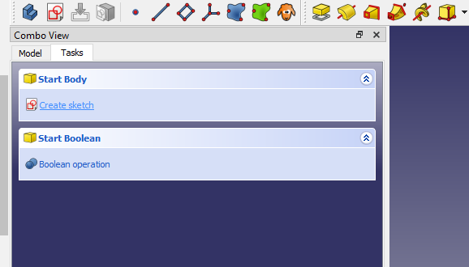
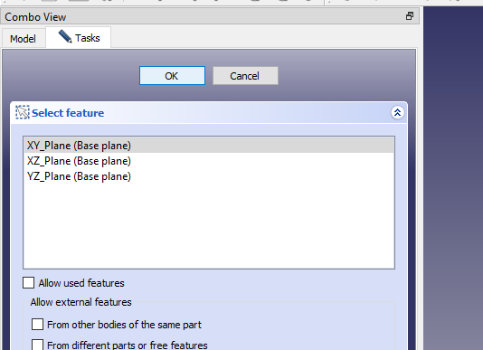

# Pad the sketch

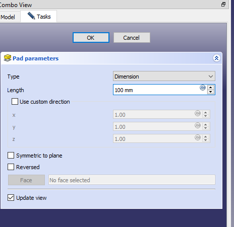

# Create a sketch on the previous pad
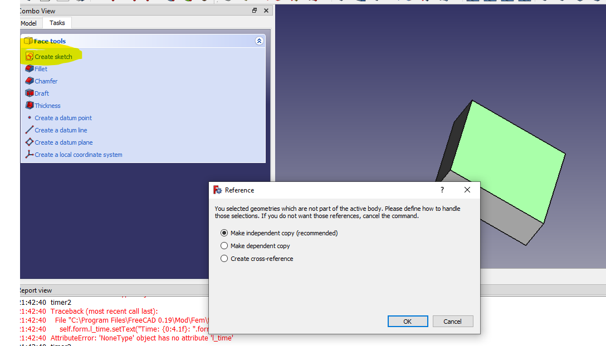
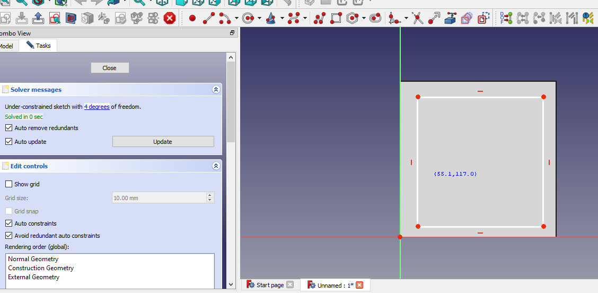

# Pad again
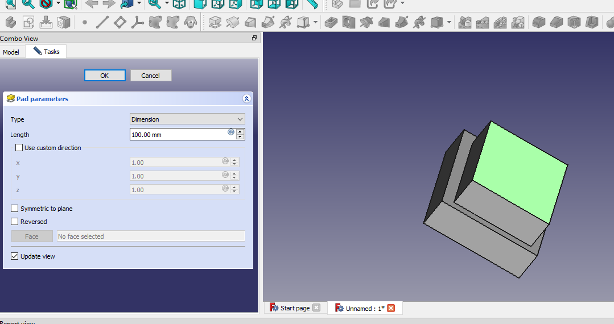

# Merge bodies using compound
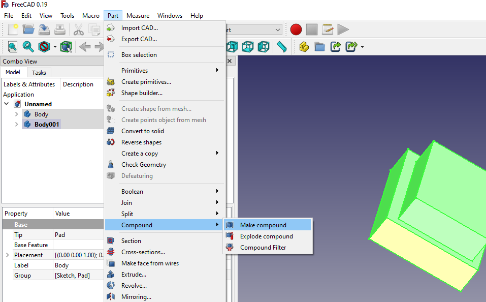
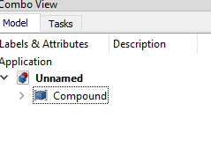

# assign first material to solid 2
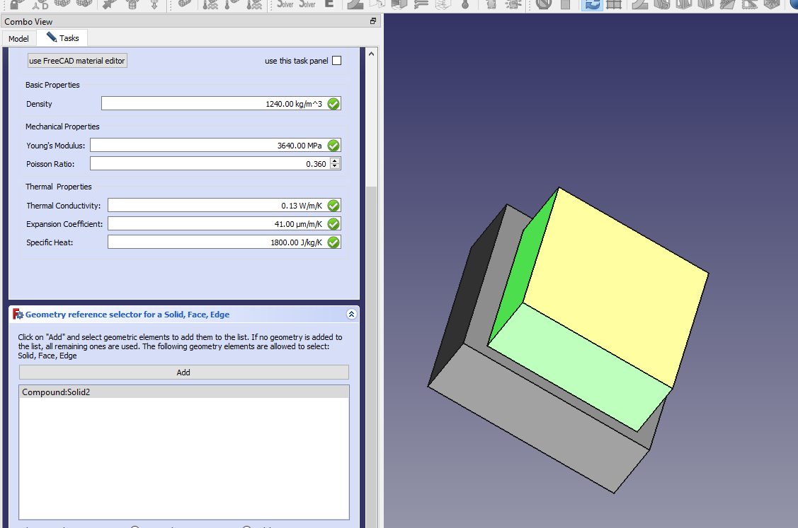

# assign second material to solid 1
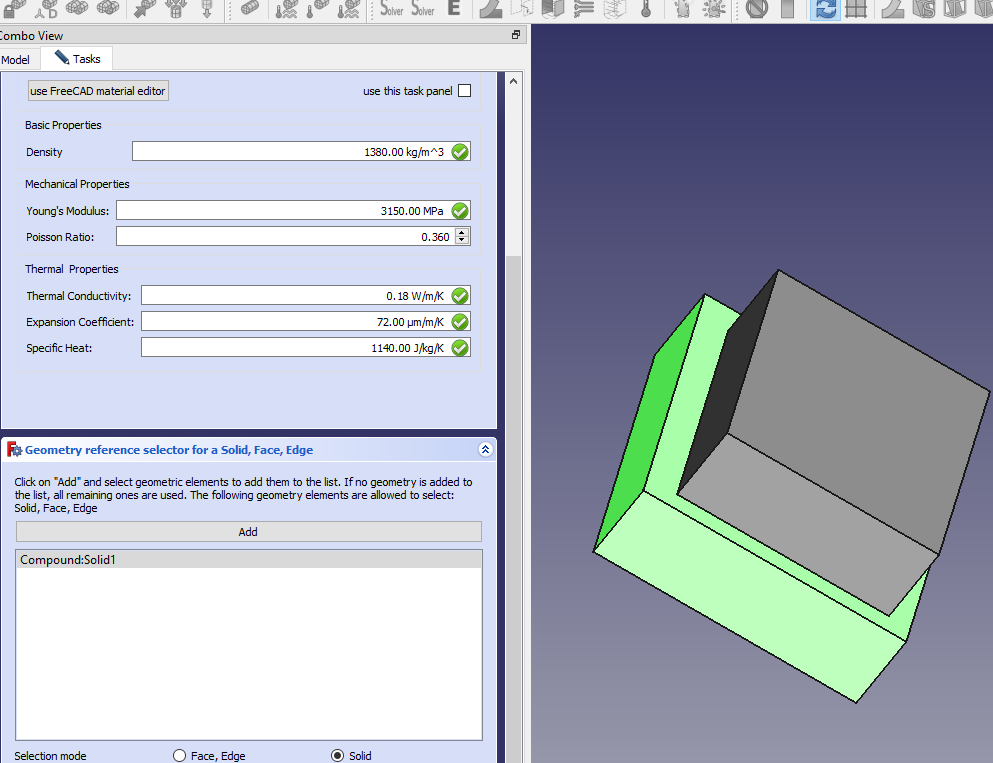

# Generate mesh with gmesh
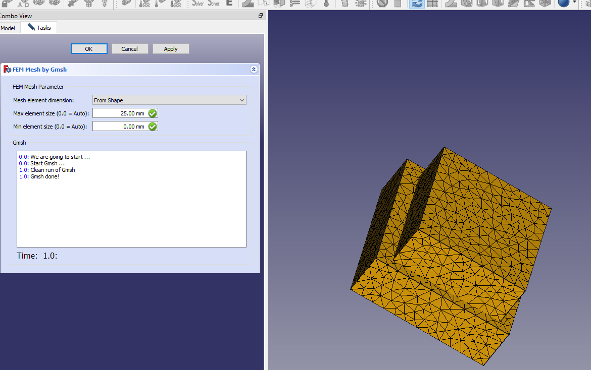

# add force and fixed constraint
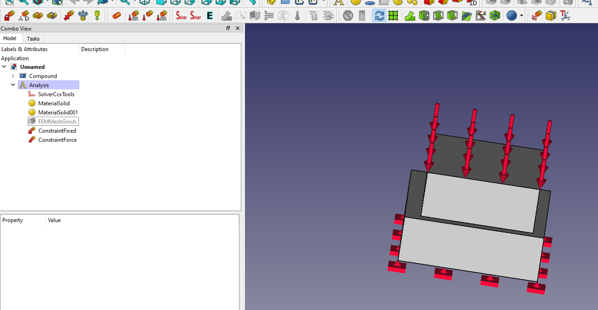

# Generate imp
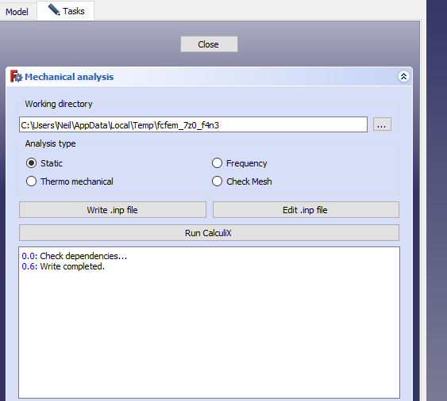

# Run CalculiX
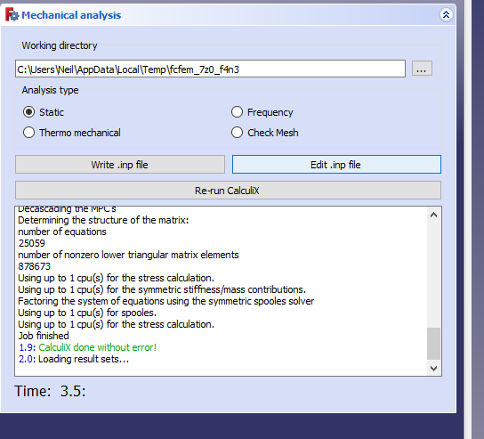

# Huge Displacement
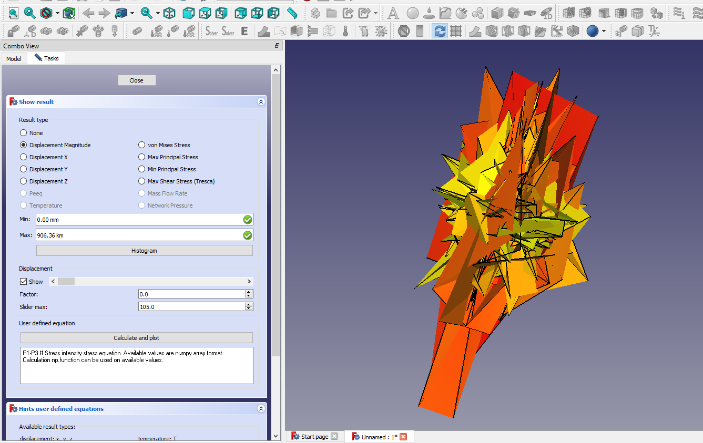