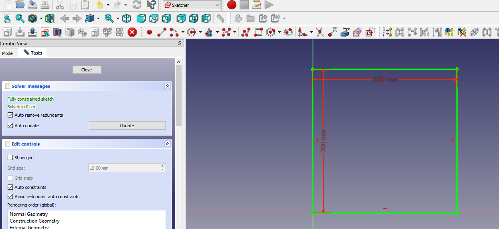

# Create a new sketch

# Pad the sketch

# Create a sketch on the previous pad

# Pad again

# Merge bodies using compound

# assign first material to solid 2

# assign second material to solid 1

# Generate mesh with gmesh

# add force and fixed constraint

# Generate imp

# Run CalculiX

# Huge Displacement
