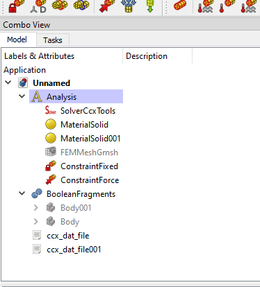
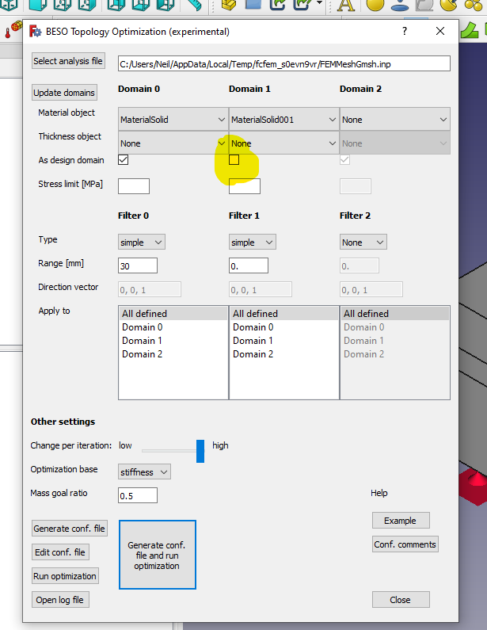
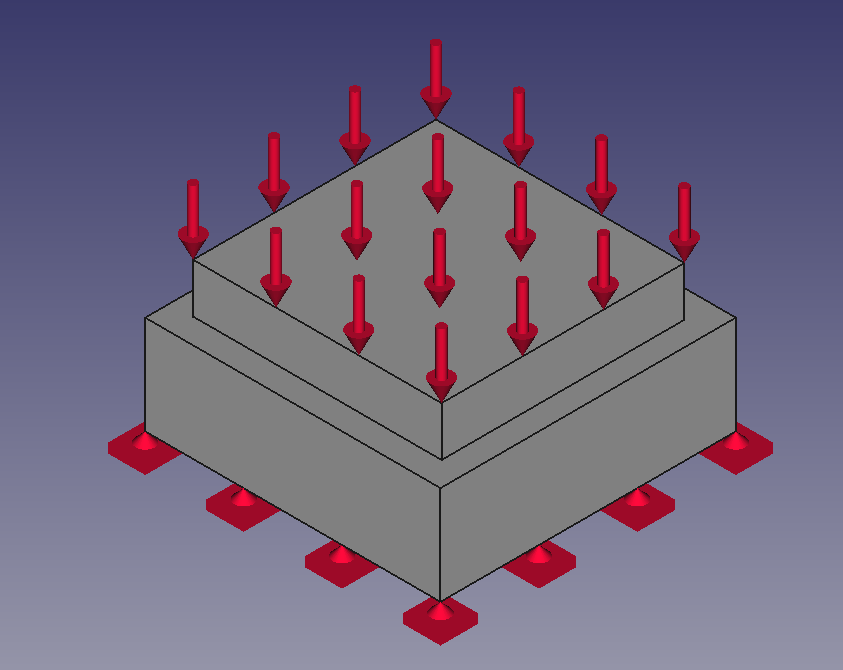
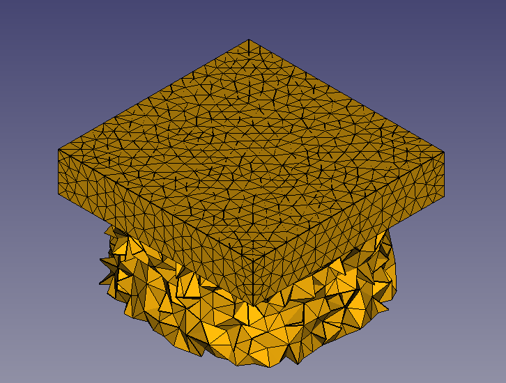

- part design
    - body
    - sketch
    - pad
    - body
    - sketch
    - pad
- part
    part > split > booleanFragments
- FEM
    - New analysis
    - new material
        - select body0
    - new material
        - select body1
    - constraintFixed
    - constraintForce
    - gmesh
    - write imp
    - run calculix to verify
- Beso macro GUI
    - select material 1
        - as design domain
        - simple
        - range == 2xmesh size
    - select material 2
        - NOT as design domain
    - set mass goal
    - run
- Load file[xxx]_state1.inp
- Winning!

